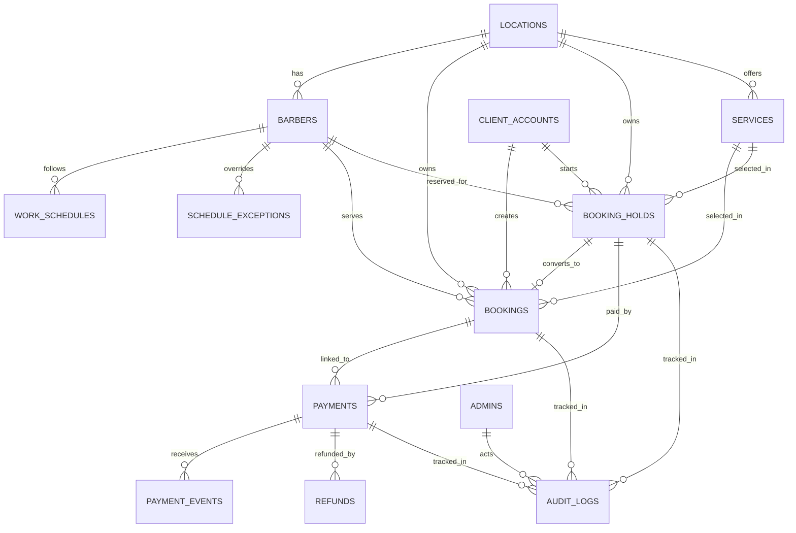

# План Централизованной БД И Онлайн-Оплаты При Записи

## Для чего этот документ

Этот файл описывает целевую схему данных и backend-flow для проекта барбершопа, если мы хотим:

- держать одну централизованную базу данных как источник истины;
- не давать пользователям "выкупать" все слоты без оплаты;
- брать депозит или полную оплату в момент онлайн-записи;
- поддерживать сайт, админку и Telegram как разные каналы поверх одной и той же бизнес-логики.

Документ опирается на текущую структуру проекта:

- `bookings`, `barbers`, `services`, `work_schedules`, `schedule_exceptions`, `client_accounts`, `admins`;
- NestJS backend с TypeORM и PostgreSQL;
- текущую публичную логику записи и клиентскую авторизацию по номеру телефона.

## Базовые архитектурные правила

1. PostgreSQL остается центральной БД и единственным источником истины.
2. Только backend пишет в БД. Frontend, Telegram и платежный провайдер работают только через API backend.
3. Redis можно использовать для rate limit, кэша и краткоживущих блокировок, но не как источник истины.
4. Все денежные статусы подтверждаются только webhook-ами платежного провайдера.
5. Все даты и время храним в UTC, а на клиенте отображаем в локальной таймзоне.
6. Для защиты слотов используем не только проверку в коде, но и ограничения PostgreSQL: транзакции и `EXCLUDE USING gist`.
7. Онлайн-запись подтверждается не в момент выбора слота, а только после успешной оплаты.

## Общая схема



## Основные сущности

### `locations`

Нужна, даже если филиал сейчас один. Это избавит от болезненной миграции, если потом появится второй адрес.

| Поле | Тип | Назначение |
|---|---|---|
| `id` | `uuid pk` | Идентификатор филиала |
| `name` | `varchar(120)` | Название точки |
| `slug` | `varchar(80) unique` | Стабильный URL/id для фронта |
| `address` | `text` | Адрес |
| `timezone` | `varchar(64)` | Таймзона филиала |
| `phone` | `varchar(20)` | Контакт филиала |
| `is_active` | `boolean` | Активность филиала |
| `created_at` | `timestamptz` | Дата создания |
| `updated_at` | `timestamptz` | Дата обновления |

### `barbers`

Текущая таблица уже близка к нужной модели, но лучше привязать мастера к филиалу.

| Поле | Тип | Назначение |
|---|---|---|
| `id` | `uuid pk` | Идентификатор мастера |
| `location_id` | `uuid fk -> locations.id` | Филиал |
| `name` | `varchar(100)` | Имя |
| `photo_url` | `text null` | Фото |
| `bio` | `text null` | Описание |
| `is_active` | `boolean` | Можно ли записываться |
| `created_at` | `timestamptz` | Дата создания |
| `updated_at` | `timestamptz` | Дата обновления |

Индексы:

- `idx_barbers_location_active(location_id, is_active)`

### `services`

Сюда добавляется платежная политика, чтобы backend понимал, брать депозит, полную оплату или ничего.

| Поле | Тип | Назначение |
|---|---|---|
| `id` | `uuid pk` | Идентификатор услуги |
| `location_id` | `uuid fk -> locations.id` | Филиал |
| `name` | `varchar(100)` | Название |
| `description` | `text null` | Описание |
| `price` | `numeric(10,2)` | Текущая цена |
| `duration_min` | `integer` | Длительность |
| `payment_policy` | `varchar(24)` | `offline`, `deposit_fixed`, `deposit_percent`, `full_prepayment` |
| `deposit_value` | `numeric(10,2) null` | Фикс. депозит или процентное значение по правилу |
| `is_active` | `boolean` | Активность |
| `created_at` | `timestamptz` | Дата создания |
| `updated_at` | `timestamptz` | Дата обновления |

Практическая рекомендация:

- для MVP оставить `price` как `numeric(10,2)`, чтобы не ломать текущую модель;
- в `payments` и `refunds` уже хранить сумму в minor units, если провайдер требует целые числа.

### `work_schedules`

Текущая сущность подходит, она остается частью централизованной модели.

| Поле | Тип | Назначение |
|---|---|---|
| `id` | `uuid pk` | Идентификатор записи |
| `barber_id` | `uuid fk -> barbers.id` | Мастер |
| `day_of_week` | `smallint` | День недели `0..6` |
| `start_time` | `time` | Начало смены |
| `end_time` | `time` | Конец смены |
| `is_day_off` | `boolean` | Выходной |

Ограничения:

- `unique(barber_id, day_of_week)`

### `schedule_exceptions`

Нужна для выходных, отпусков и особых дней.

| Поле | Тип | Назначение |
|---|---|---|
| `id` | `uuid pk` | Идентификатор |
| `barber_id` | `uuid fk -> barbers.id` | Мастер |
| `date` | `date` | Конкретная дата |
| `start_time` | `time null` | Время начала, если рабочий день изменен |
| `end_time` | `time null` | Время окончания |
| `is_day_off` | `boolean` | Полный выходной |
| `reason` | `varchar(120) null` | Причина |

Ограничения:

- `unique(barber_id, date)`

### `client_accounts`

Эта таблица у вас уже есть. Ее стоит оставить как центральный профиль клиента.

| Поле | Тип | Назначение |
|---|---|---|
| `id` | `uuid pk` | Идентификатор клиента |
| `phone` | `varchar(20) unique` | Нормализованный телефон |
| `name` | `varchar(100)` | Имя по умолчанию |
| `pin_hash` | `varchar(255)` | Хеш PIN |
| `telegram_username` | `varchar(64) null` | Telegram |
| `created_at` | `timestamptz` | Дата создания |
| `updated_at` | `timestamptz` | Дата обновления |

Опционально позже:

- `is_blocked`
- `failed_login_count`
- `last_login_at`

### `booking_holds`

Это главная новая таблица для анти-абуза. Пока пользователь не оплатил, слот не становится полноценной записью, а живет как временный hold.

| Поле | Тип | Назначение |
|---|---|---|
| `id` | `uuid pk` | Идентификатор hold |
| `location_id` | `uuid fk -> locations.id` | Филиал |
| `client_account_id` | `uuid fk -> client_accounts.id null` | Автор hold |
| `barber_id` | `uuid fk -> barbers.id` | Мастер |
| `service_id` | `uuid fk -> services.id` | Услуга |
| `client_name` | `varchar(100)` | Снэпшот имени |
| `client_phone` | `varchar(20)` | Снэпшот телефона |
| `client_telegram_username` | `varchar(64) null` | Снэпшот Telegram |
| `start_time` | `timestamptz` | Начало слота |
| `end_time` | `timestamptz` | Конец слота |
| `price_snapshot` | `numeric(10,2)` | Цена на момент hold |
| `deposit_amount` | `numeric(10,2)` | Сумма к оплате сейчас |
| `currency` | `char(3)` | Например `UAH` |
| `status` | `varchar(24)` | `created`, `payment_pending`, `paid`, `converted`, `expired`, `released`, `failed` |
| `payment_provider` | `varchar(32) null` | Код провайдера |
| `provider_checkout_ref` | `varchar(120) null` | Идентификатор checkout/session |
| `idempotency_key` | `uuid` | Идемпотентность на создание checkout |
| `expires_at` | `timestamptz` | Когда hold истекает |
| `converted_booking_id` | `uuid fk -> bookings.id null unique` | Во что конвертировался |
| `created_at` | `timestamptz` | Дата создания |
| `updated_at` | `timestamptz` | Дата обновления |

Ключевые индексы и ограничения:

- `idx_booking_holds_expires_at(expires_at)`
- `idx_booking_holds_phone_status(client_phone, status, expires_at desc)`
- `unique(provider_checkout_ref)` при наличии внешнего checkout id
- `EXCLUDE USING gist (barber_id WITH =, tstzrange(start_time, end_time, '[)') WITH &&) WHERE (status IN ('created','payment_pending','paid'))`

Это ограничение не даст создать два активных hold на пересекающийся слот у одного мастера.

### `bookings`

Текущая таблица уже есть, но в модели с оплатой она становится итоговым подтвержденным объектом, а не черновиком.

| Поле | Тип | Назначение |
|---|---|---|
| `id` | `uuid pk` | Идентификатор записи |
| `location_id` | `uuid fk -> locations.id` | Филиал |
| `booking_hold_id` | `uuid fk -> booking_holds.id null unique` | Из какого hold создана |
| `client_account_id` | `uuid fk -> client_accounts.id null` | Клиент |
| `barber_id` | `uuid fk -> barbers.id` | Мастер |
| `service_id` | `uuid fk -> services.id` | Услуга |
| `source` | `varchar(16)` | `site`, `admin`, `telegram` |
| `client_name` | `varchar(100)` | Снэпшот имени |
| `client_phone` | `varchar(20)` | Снэпшот телефона |
| `client_telegram_username` | `varchar(64) null` | Снэпшот Telegram |
| `price_snapshot` | `numeric(10,2)` | Цена на момент записи |
| `deposit_amount` | `numeric(10,2)` | Сумма депозита |
| `currency` | `char(3)` | Валюта |
| `payment_status` | `varchar(24)` | `unpaid`, `partially_paid`, `paid`, `refunded`, `partial_refund` |
| `status` | `varchar(24)` | `confirmed`, `canceled`, `completed`, `no_show` |
| `manage_token_hash` | `varchar(64)` | Для публичного доступа по ссылке |
| `notes` | `text null` | Комментарий клиента |
| `cancel_reason` | `text null` | Причина отмены |
| `canceled_at` | `timestamptz null` | Когда отменили |
| `completed_at` | `timestamptz null` | Когда завершили |
| `created_at` | `timestamptz` | Дата создания |
| `updated_at` | `timestamptz` | Дата обновления |

Ключевые индексы и ограничения:

- `idx_bookings_barber_start(barber_id, start_time)`
- `idx_bookings_client_account_status(client_account_id, status, start_time desc)`
- `idx_bookings_phone_status(client_phone, status, start_time desc)`
- `EXCLUDE USING gist (barber_id WITH =, tstzrange(start_time, end_time, '[)') WITH &&) WHERE (status IN ('confirmed','completed','no_show'))`

Практический смысл:

- hold защищает слот до оплаты;
- booking фиксирует уже подтвержденную запись;
- даже если два запроса пройдут почти одновременно, БД все равно отрежет конфликт.

### `payments`

Эта таблица хранит каждую попытку платежа, а не только финальный успех. Это важно для повторных попыток, возвратов и разборов спорных кейсов.

| Поле | Тип | Назначение |
|---|---|---|
| `id` | `uuid pk` | Идентификатор платежа |
| `booking_hold_id` | `uuid fk -> booking_holds.id null` | Hold, ради которого создавался платеж |
| `booking_id` | `uuid fk -> bookings.id null` | Итоговая запись |
| `provider` | `varchar(32)` | Код провайдера |
| `kind` | `varchar(24)` | `deposit`, `full_payment`, `balance` |
| `amount` | `numeric(10,2)` | Сумма |
| `currency` | `char(3)` | Валюта |
| `status` | `varchar(24)` | `created`, `pending`, `authorized`, `paid`, `failed`, `canceled`, `refunded`, `partial_refund` |
| `provider_payment_ref` | `varchar(120) null` | ID платежа у провайдера |
| `provider_checkout_ref` | `varchar(120) null` | ID checkout/session |
| `idempotency_key` | `uuid` | Защита от дублей |
| `failure_code` | `varchar(80) null` | Код ошибки провайдера |
| `failure_reason` | `text null` | Текст ошибки |
| `authorized_at` | `timestamptz null` | Когда авторизовали |
| `paid_at` | `timestamptz null` | Когда оплатили |
| `metadata` | `jsonb null` | Провайдерские детали |
| `created_at` | `timestamptz` | Дата создания |
| `updated_at` | `timestamptz` | Дата обновления |

Индексы и ограничения:

- `unique(provider, provider_payment_ref)`
- `unique(idempotency_key)`
- `idx_payments_hold_status(booking_hold_id, status)`
- `idx_payments_booking_status(booking_id, status)`

### `payment_events`

Нужна для webhook-идемпотентности и разбора сложных кейсов.

| Поле | Тип | Назначение |
|---|---|---|
| `id` | `uuid pk` | Внутренний ID |
| `payment_id` | `uuid fk -> payments.id null` | С каким платежом связан event |
| `provider` | `varchar(32)` | Код провайдера |
| `provider_event_id` | `varchar(120)` | Уникальный event id от провайдера |
| `event_type` | `varchar(80)` | Тип события |
| `processing_status` | `varchar(24)` | `received`, `processed`, `ignored`, `failed` |
| `payload` | `jsonb` | Сырой webhook |
| `signature_valid` | `boolean` | Проверка подписи |
| `error_message` | `text null` | Текст ошибки |
| `received_at` | `timestamptz` | Когда получили |
| `processed_at` | `timestamptz null` | Когда обработали |

Ограничения:

- `unique(provider, provider_event_id)`

### `refunds`

Возвраты лучше хранить отдельно, а не пытаться "втиснуть" их целиком в таблицу `payments`.

| Поле | Тип | Назначение |
|---|---|---|
| `id` | `uuid pk` | Идентификатор возврата |
| `payment_id` | `uuid fk -> payments.id` | Из какого платежа возврат |
| `booking_id` | `uuid fk -> bookings.id` | Какая запись |
| `amount` | `numeric(10,2)` | Сумма возврата |
| `currency` | `char(3)` | Валюта |
| `reason` | `varchar(120)` | Причина |
| `status` | `varchar(24)` | `created`, `pending`, `succeeded`, `failed` |
| `provider_refund_ref` | `varchar(120) null` | ID возврата у провайдера |
| `created_by_admin_id` | `uuid fk -> admins.id null` | Кто инициировал |
| `created_at` | `timestamptz` | Дата создания |
| `updated_at` | `timestamptz` | Дата обновления |

### `admins`

Текущую таблицу оставляем как есть. Она уже подходит для админки и аудита.

### `audit_logs`

Эта таблица очень полезна, когда появятся платежи, возвраты и ручные действия админа.

| Поле | Тип | Назначение |
|---|---|---|
| `id` | `uuid pk` | Идентификатор |
| `actor_type` | `varchar(16)` | `admin`, `client`, `system`, `provider` |
| `actor_id` | `uuid null` | Кто совершил действие |
| `entity_type` | `varchar(32)` | `booking`, `booking_hold`, `payment`, `refund` |
| `entity_id` | `uuid` | ID сущности |
| `action` | `varchar(64)` | Например `booking.canceled` |
| `before_state` | `jsonb null` | Что было |
| `after_state` | `jsonb null` | Что стало |
| `ip` | `inet null` | Если важно |
| `created_at` | `timestamptz` | Когда произошло |

## Статусы и переходы

### Статусы `booking_holds`

| Статус | Что означает |
|---|---|
| `created` | Hold создан, checkout еще не открыт |
| `payment_pending` | Checkout создан, пользователь ушел платить |
| `paid` | Платеж подтвержден, но booking еще не создан в транзакции |
| `converted` | Hold успешно превратился в booking |
| `expired` | Время hold вышло |
| `released` | Hold был отменен до оплаты |
| `failed` | Платеж не прошел или hold невозможно завершить |

### Статусы `bookings`

| Статус | Что означает |
|---|---|
| `confirmed` | Онлайн-запись подтверждена или создана админом |
| `canceled` | Запись отменена |
| `completed` | Услуга оказана |
| `no_show` | Клиент не пришел |

### Статусы `payments`

| Статус | Что означает |
|---|---|
| `created` | Запись о платеже создана, провайдер еще не ответил |
| `pending` | Пользователь платит, ожидаем webhook |
| `authorized` | Деньги авторизованы, но еще не списаны окончательно |
| `paid` | Платеж успешно завершен |
| `failed` | Ошибка или отказ |
| `canceled` | Пользователь отменил оплату |
| `refunded` | Полный возврат |
| `partial_refund` | Частичный возврат |

### Статусы `refunds`

| Статус | Что означает |
|---|---|
| `created` | Возврат создан локально |
| `pending` | Отправлен провайдеру |
| `succeeded` | Возврат завершен |
| `failed` | Возврат не удался |

## Логика защиты от выкупа времени

Ниже минимальный набор правил, который стоит реализовать сразу:

1. Один телефон может иметь не больше одного активного `booking_hold` одновременно.
2. Один телефон может иметь не больше двух будущих активных `bookings`.
3. Один телефон не может держать больше одной онлайн-записи на один день.
4. Hold живет 10-15 минут, потом переводится в `expired`.
5. Если по одному телефону много подряд провальных hold, вводится временный cooldown.
6. Для онлайн-записи обязателен депозит или полная предоплата.
7. Админские записи могут обходить эти ограничения по отдельному флагу.

Что дает такая модель:

- пользователь уже не может забрать много слотов "просто так";
- даже если откроет оплату на нескольких вкладках, активный hold будет один;
- неоплаченные слоты быстро возвращаются в пул.

## Набор backend endpoint-ов

Ниже описан не публичный UI-flow, а именно серверный контракт.

### Публичные и клиентские endpoint-ы

| Метод | Endpoint | Назначение |
|---|---|---|
| `GET` | `/services` | Список услуг |
| `GET` | `/barbers` | Список мастеров |
| `GET` | `/barbers/:id/slots?date=YYYY-MM-DD&serviceId=...` | Получение доступных слотов |
| `POST` | `/client-auth/register` | Регистрация по телефону |
| `POST` | `/client-auth/login` | Вход по телефону |
| `GET` | `/client-auth/me` | Текущий клиент |
| `POST` | `/client-auth/logout` | Выход |
| `POST` | `/booking-holds` | Создать временный hold под слот |
| `GET` | `/booking-holds/:id` | Получить состояние hold и таймер |
| `POST` | `/payments/checkout` | Создать checkout/session для hold |
| `GET` | `/payments/checkout/:holdId/status` | Статус ожидания оплаты для фронта |
| `GET` | `/bookings/:id?token=...` | Публичный просмотр записи по manage token |
| `POST` | `/bookings/:id/cancel` | Отмена записи |
| `POST` | `/bookings/:id/reschedule-hold` | Начать перенос через новый hold |

### Endpoint-ы админки

| Метод | Endpoint | Назначение |
|---|---|---|
| `GET` | `/admin/bookings` | Список записей |
| `POST` | `/admin/bookings` | Ручное создание записи |
| `PATCH` | `/admin/bookings/:id/status` | Обновление статуса |
| `GET` | `/admin/booking-holds` | Просмотр активных hold |
| `GET` | `/admin/payments` | Список платежей |
| `GET` | `/admin/payments/:id` | Детали платежа |
| `POST` | `/admin/bookings/:id/refunds` | Запуск возврата |
| `POST` | `/admin/bookings/:id/cancel-with-refund` | Отмена с возвратом по правилу |

### Webhook endpoint-ы

| Метод | Endpoint | Назначение |
|---|---|---|
| `POST` | `/payments/webhooks/:provider` | Прием webhook-ов провайдера |

Практическое замечание:

- frontend может получить redirect на страницу "оплата успешна";
- backend не должен доверять этому redirect;
- финальное подтверждение записи происходит только после webhook.

## Пошаговый backend-flow

### 1. Поиск слотов

Frontend вызывает:

```http
GET /barbers/:id/slots?date=2026-04-23&serviceId=<uuid>
```

Backend:

1. Проверяет, что мастер и услуга активны.
2. Берет расписание и исключения.
3. Находит пересечения с:
   - активными `bookings`;
   - активными `booking_holds`.
4. Возвращает только свободные слоты.

Важно:

- после появления `booking_holds` свободные слоты считаются не только по `bookings`, но и по временным hold.

### 2. Создание hold

Frontend вызывает:

```http
POST /booking-holds
Content-Type: application/json

{
  "barberId": "uuid",
  "serviceId": "uuid",
  "startTime": "2026-04-23T12:00:00Z",
  "clientName": "Alex",
  "clientPhone": "+380...",
  "clientTelegramUsername": "alexbarber"
}
```

Backend делает:

1. Нормализует телефон.
2. Если клиент авторизован, берет телефон из `client_accounts`, а не из body.
3. Проверяет lead time.
4. Проверяет лимиты по телефону:
   - активные hold;
   - активные будущие bookings;
   - лимит на один день.
5. Проверяет, что слот входит в график.
6. В транзакции создает `booking_hold`.
7. Ставит `expires_at = now + 10..15 minutes`.
8. Возвращает `holdId`, `expiresAt`, `depositAmount`, `currency`.

Ожидаемый ответ:

```json
{
  "id": "hold-uuid",
  "status": "created",
  "expiresAt": "2026-04-22T10:25:00.000Z",
  "depositAmount": "200.00",
  "currency": "UAH"
}
```

### 3. Создание checkout/session

Frontend вызывает:

```http
POST /payments/checkout
Content-Type: application/json

{
  "holdId": "hold-uuid"
}
```

Backend делает:

1. Находит hold и проверяет, что он не истек.
2. Проверяет, что статус hold еще допускает оплату.
3. Создает запись `payments` со статусом `created`.
4. Вызывает платежный adapter/provider.
5. Сохраняет `provider_checkout_ref`.
6. Переводит hold в `payment_pending`.
7. Возвращает `checkoutUrl` или `paymentToken` в зависимости от провайдера.

Ожидаемый ответ:

```json
{
  "paymentId": "payment-uuid",
  "status": "pending",
  "checkoutUrl": "https://provider.example/checkout/...",
  "expiresAt": "2026-04-22T10:25:00.000Z"
}
```

### 4. Ожидание оплаты на frontend

Frontend может:

- увести пользователя на hosted checkout;
- или открыть embedded checkout;
- затем опрашивать `GET /payments/checkout/:holdId/status`.

Backend на этом endpoint просто возвращает:

- статус hold;
- статус платежа;
- booking id, если запись уже подтверждена webhook-ом.

### 5. Получение webhook от провайдера

Провайдер вызывает:

```http
POST /payments/webhooks/:provider
```

Это критический участок. Логика должна быть строго идемпотентной.

Backend делает:

1. Проверяет подпись webhook.
2. Сохраняет raw payload в `payment_events`.
3. Если `(provider, provider_event_id)` уже были обработаны, сразу отвечает `200 OK`.
4. Открывает транзакцию.
5. Находит `payments` по `provider_payment_ref` или `provider_checkout_ref`.
6. Блокирует строку платежа и связанный hold через `FOR UPDATE`.
7. Обновляет статус `payments`.
8. Если webhook говорит `paid`:
   - переводит hold в `paid`;
   - проверяет, не истек ли hold;
   - если hold валиден, создает `booking`;
   - переводит hold в `converted`;
   - проставляет `converted_booking_id`;
   - привязывает платеж к booking.
9. Если hold уже истек к моменту webhook:
   - не создает booking;
   - помечает кейс как `manual_review` через `audit_logs` или отдельный internal alert;
   - по бизнес-правилу запускает автоматический возврат или ручную обработку.
10. Помечает `payment_events.processing_status = processed`.
11. После commit отправляет уведомления в Telegram/клиенту.

### 6. Создание итоговой записи

Booking создается только из webhook-обработчика, а не из frontend callback.

Что попадает в `bookings`:

- ссылка на `booking_hold_id`;
- снэпшоты клиента;
- цена и депозит на момент оплаты;
- `status = confirmed`;
- `payment_status = paid`;
- `manage_token_hash`.

### 7. Открытие страницы подтверждения

Frontend может показывать подтверждение только после того, как один из каналов вернул:

- `bookingId`;
- или `hold.status = converted`.

После этого уже используется публичный endpoint:

```http
GET /bookings/:id?token=...
```

### 8. Отмена записи

Frontend или кабинет клиента вызывает:

```http
POST /bookings/:id/cancel
```

Backend делает:

1. Проверяет права на запись по login/cookie или `manage token`.
2. Проверяет, можно ли отменять по времени.
3. Меняет `bookings.status` на `canceled`.
4. Рассчитывает refund policy:
   - полный возврат;
   - частичный возврат;
   - без возврата.
5. Если нужен возврат:
   - создает `refunds`;
   - вызывает провайдера;
   - обновляет `payments.status`.

### 9. Перенос записи

Для переноса я рекомендую не "двигать" старую запись напрямую, а идти через новый hold:

1. `POST /bookings/:id/reschedule-hold`
2. backend проверяет новый слот;
3. создает новый hold;
4. если депозит переносится без доплаты, новый payment не нужен;
5. если нужна доплата, создается дополнительный `payment`;
6. после успешного завершения старая booking переводится в `canceled`, новая создается как `confirmed`.

Для MVP можно упростить:

- разрешить перенос только если цена и услуга не меняются;
- просто переносить существующий депозит на новый слот.

## Подробная логика webhook-обработчика

Ниже схема, которую стоит считать обязательной.

```text
1. Получить webhook
2. Проверить подпись
3. Сохранить event в payment_events
4. Если event дубль -> вернуть 200
5. Начать transaction
6. Найти payment + hold
7. Заблокировать payment и hold
8. Обновить payment.status
9. Если success:
   9.1. Проверить hold.status
   9.2. Проверить expires_at
   9.3. Если booking еще не создан:
        - создать booking
        - обновить hold.converted_booking_id
        - hold.status = converted
10. Если fail:
   - payment.status = failed
   - hold.status = failed или created, если даем повторную попытку
11. Пометить event processed
12. Commit
13. Отправить уведомления
```

Критично:

- webhook должен быть идемпотентен;
- нельзя создавать booking дважды;
- нельзя полагаться на frontend redirect;
- нельзя позволять webhook без валидной подписи менять статус денег.

## Фоновые задачи

Помимо endpoint-ов понадобятся фоновые job-ы.

### `expire-booking-holds`

Периодичность:

- каждые 30-60 секунд.

Что делает:

1. Находит hold со статусами `created`, `payment_pending`, `paid`, у которых `expires_at < now()`.
2. Если booking еще не создан, переводит hold в `expired`.
3. При необходимости создает задачу на возврат денег для "оплатили слишком поздно".

### `payment-reconciliation`

Периодичность:

- раз в 5-15 минут.

Что делает:

1. Ищет платежи со статусом `pending`, которые висят слишком долго.
2. Сверяет их статус у провайдера.
3. Догоняет потерянные webhook-и.

Это сильно снижает риск зависших оплат и "потерянных" бронирований.

## Как это встраивается в текущий backend

На основе текущей структуры проекта я бы внедрял это так.

### Модули, которые можно переиспользовать

| Текущий модуль | Что остается |
|---|---|
| `client-auth` | Регистрация и сессия клиента по телефону |
| `bookings` | Общая доменная логика записи, но без мгновенного `createBooking` для сайта |
| `barbers` | Справочник мастеров |
| `services` | Справочник услуг и платежной политики |
| `schedule` | Графики и исключения |
| `telegram` | Уведомления о подтверждении, отмене, переносе |

### Новые модули, которые стоит добавить

| Модуль | Назначение |
|---|---|
| `booking-holds` | Создание hold, TTL, анти-абуз проверки |
| `payments` | Checkout, status polling, интеграция с провайдером |
| `payment-webhooks` | Подписи, idempotency, обработка callback |
| `refunds` | Логика возвратов |
| `jobs` | Expire holds и reconciliation |

### Что менять в текущем `bookings` модуле

Сейчас публичный `POST /bookings` сразу создает запись. Для модели с оплатой его лучше заменить на:

1. `POST /booking-holds`
2. `POST /payments/checkout`
3. webhook создает финальный `booking`

Админский `POST /admin/bookings` можно оставить как прямое создание booking без hold и оплаты.

## Рекомендуемый порядок внедрения

### Этап 1. Подготовка схемы БД

1. Добавить `locations`.
2. Расширить `services` полями платежной политики.
3. Добавить `booking_holds`.
4. Добавить `payments`, `payment_events`, `refunds`.
5. Расширить `bookings` полями `booking_hold_id`, `payment_status`, `source`, `price_snapshot`, `deposit_amount`, `currency`.

### Этап 2. Перевести публичную запись на hold

1. Новый endpoint `POST /booking-holds`.
2. Слоты считаются с учетом hold.
3. Текущий публичный `POST /bookings` перестает использоваться для сайта.

### Этап 3. Подключить платежи

1. `POST /payments/checkout`
2. `POST /payments/webhooks/:provider`
3. polling endpoint статуса checkout

### Этап 4. Добавить возвраты и перенос

1. `POST /admin/bookings/:id/refunds`
2. `POST /bookings/:id/cancel`
3. `POST /bookings/:id/reschedule-hold`

### Этап 5. Фоновые job-ы и аудит

1. expire holds
2. payment reconciliation
3. audit logs

## Минимальный MVP, если делать без перегруза

Если нужна практичная первая версия, а не идеальная "на все случаи", то я бы делал так:

1. Одна центральная PostgreSQL БД.
2. `booking_holds` с TTL 10 минут.
3. Депозит, а не полная предоплата.
4. Booking создается только после webhook.
5. Один активный hold на телефон.
6. Максимум две будущие записи на один телефон.
7. Возвраты пока только из админки.

Этого уже достаточно, чтобы:

- убрать основной абуз с "выкупом" времени;
- сохранить понятную UX-логику;
- не перегрузить проект лишней сложностью на старте.

## Что считать готовым результатом

Схема считается внедренной правильно, если выполняются все условия:

1. Нельзя создать две подтвержденные записи на один и тот же слот.
2. Нельзя удерживать слот бесконечно без оплаты.
3. Нельзя подтвердить booking без webhook-а провайдера.
4. Можно восстановить историю каждого платежа и каждого webhook-события.
5. Админ видит, кто оплатил, кто нет, кто отменил и кому нужен возврат.

---

Версия документа: `1.0`
Дата: `2026-04-22`
Назначение: технический blueprint для миграций БД и backend-интеграции оплаты
